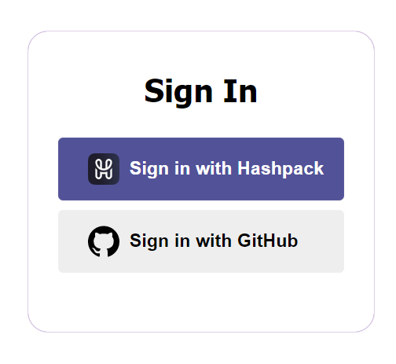
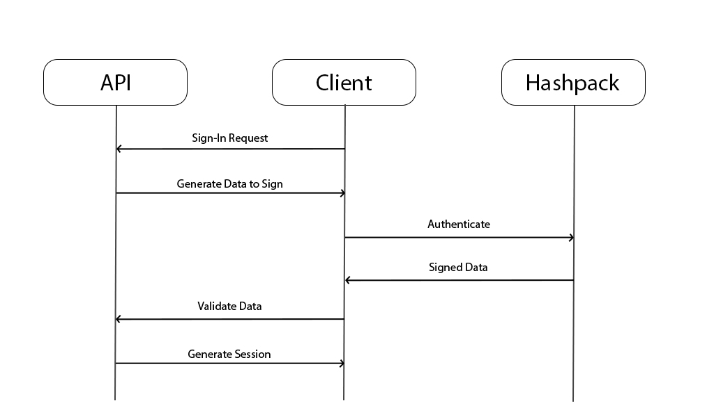

# next-auth-hashpack

NextAuth.js is an open-source library that simplifies the implementation of authentication in serverless and server-rendered web applications using various authentication providers. It is built on top of the Next.js framework and provides a simple API and pre-built authentication providers. 

<br>
The next-auth-hashpack package is designed to enable NextAuth.js to use Hashpack Wallet as an authentication provider. This package allows users to sign in and authenticate using Hashpack Wallet & covers all the major steps.

<br>

## install
`npm install next-auth-hashpack`

<br>

## UI View


<br>

# The Flow



<br>

# Usage

<br>

## **HashpackProvider**

after configuring next-auth, call `HashpackProvider` in the providers array:

```javascript pages/api/auth/[...nextauth].ts
NextAuth({
    providers: [
        hashpackProvider({
            userReturnCallback: ({ accountId, network }, userPublicKey) => {
                return { id: "DavinciGraph", accountId: accountId }
            },
            privateKey: "ServerAccountPrivateKey",
            mirrorNodeAccountInfoURL: {
                testnet: 'https://testnet.mirrornode.hedera.com/api/v1/accounts',
                mainnet: 'https://mainnet-public.mirrornode.hedera.com/api/v1/accounts'
            },
            getUserPublicKey: ({accountId, network}) => {
                "mechanism to return user's public key"
                return "UserPublicKey";
            },
            checkOriginalData: ({accountId, originalData, network}) => {
                "check the originData you had sent to the user to sign with an external source like database"
                return true;
            },
            debug: true
        })
    ]
})
```

<br>

### __hashpackProvider Options__

**userReturnCallback** <br>
**_`mandatory`_** this callback would be executed when user is authenticated successfully. it gets credentials inputs including user's accountId which can be used to fetch user's data from for example a database, and userPublicKey.

```javascript pages/api/auth/[...nextauth].ts
hashpackProvider({
    ...
    userReturnCallback: ({signedPayload, userSignature, accountId, network}, userPublicKey) => {}
})
```

<br>

**privateKey** <br>
**_`mandatory`_** the server's hedera hashgraph account private key, this key would be used to generate a publicKey and verify the signed data. after version 1.1.6 private key for different network is supported.

```javascript pages/api/auth/[...nextauth].ts
hashpackProvider({
    ...
    privateKey: "server private key",

    //or
    privateKey: (network) => {
        if( network === 'mainnet' ){
            return 'pk for mainnet.'
        }

        return 'pk for testnet';
    }

    // or
    privateKey: {
        testnet: "server private key for testnet",
        mainnet: "server private key for mainnet"
    }
})
```

> 💡 Attention: prior to 1.2.2 we had used publicKey directly but it has some issues with verifying on mainnet. therefore after that we generate the publicKey from this privateKey
<br>

<br>

**mirrorNodeAccountInfoURL** <br>
**_`optional for development`_** after version 1.0.6 you must define this variable as an object with two properties `tesetnet` and `mainnet` which both are urls pointing to a mirror node to get an account information. If left empty default urls are the public mirror nodes.

<br>

**getUserPublicKey** <br>
**_`optional`_** if you want to implement your mechanism to get user's account public key, you can pass a callback to this property. you'll get signing-in user account id as the input

```javascript pages/api/auth/[...nextauth].ts
hashpackProvider({
    ...
    getUserPublicKey: ({accountId, network}) => {
        return "mechanism to return user's public key"
    }
})
```

<br>

**checkOriginalData** <br>
**_`optional`_** if you want to add an extra security layer to check if the data you had sent to the user matches the receiving one, you can use this function.

```javascript pages/api/auth/[...nextauth].ts
hashpackProvider({
    ...
    checkOriginalData: ({accountId, originalData, network}) => {
        "check the originData you had sent to the user to sign with an external source like database"
        return true;
    }
})
```

<br>

**debug** <br>
**_`optional`_** a flag which when true shows the process of running functionalities in the console.

<br>

## **authInitializer**
The usual next-auth providers have a similar flow to initiate authentication(since they implement OAuth standard), but with a cryptocurrency wallet this is not available. therefore we need another route, which must be created manually.

<br>

By default, a `hashpack.ts` file is supposed to exist in `pages/api/auth` containing a route that calls `authInitializer` as presented in the following snippet.

```javascript pages/api/auth/hashpack.ts
export default async function hashpack(req: NextApiRequest, res: NextApiResponse) {
    const accountId = AccountId("server's hedera account Id");
    const privateKey = PrivateKey.fromString("Server's hedera account private key");

    let data = {
        url: 'https://davincigraph.io', 
        data: {
            token: "a randomly generated token"
        }
    };

    // optionally you can define a preInitializingCallback and give it to authInitializer.
    // after validation of user's account ID, preInitializingCallback would receive it
    const preInitializingCallback = (accountId) => {
        // logic: e.g. store the accountId and data in the database
    }

    // return whatever authInitializer return to to prevent stale requests
    return authInitializer(req, res, accountId, privateKey, data, "testnet", preInitializingCallback, true);
    // the final argument is hedera network, and it accepts either testnet or mainnet
}
```

<br>

as you see, `authInitializer` requires the route `request` and `response`, server's Hedera hashgraph `account Id` and `private key`, and some `data` to be signed by both parts (server & user). also a `preInitializingCallback` that would run after validation of the request. debug is also available here.

> 💡 the `pages/api/auth/hashpack.ts` path is not mandatory and the route can be created anywhere needed, the client knows about it in a way which would be explained in the following.

> 💡 the request contains `network` in its body object.

<br>

### Sign-in page
the other essential configuration for the next-auth is the sign-in page url. by default next-auth creates a page with this url pages/api/auth/signin. as you remembered crypto wallets cannot authenticate like oAuth providers by the default page treat all as that, so we cannot use it. instead we use some of next-auth-hashpack functionalities in the react.

to change the sign-in page url:

```javascript pages/api/[...nextauth].ts
NextAuth({
    providers: [
        ...
    ],
    pages: {
        signIn: "/auth/signin" // you can write any path you want
    }
})
```

<br>
<br>
<br>

# React
The previous functionalities described are responsible for handling the authentication flow related to the backend. In contrast, the following section explains how the frontend handles the authentication flow.

<br>

## **hashConnect**
To connect to hashpack at any time, we must instantiate HashConnect and hold some of its properties as states. next-auth-hashpack requires 3 entries to interact with hashpack. the `hashConnect instance`, `hedera network`, `hashConnect topic`, `hashConnect state`, and the state holding the paired or to-be-paired user's `account id`.

> 💡 Notice that another prerequisite is to have next-auth session context set up.
<br>

> 💡 Import HashConnect instance from this path:
```javascript
import { HashConnect } from "hashconnect/dist/esm/hashconnect"; 
```

<br>

## **useHashpackAuthentication** hook
returns `authenticate` function & `error` state. when `authenticate` function is called it initiate the hashpack authentication flow, for example by clicking on a button.


```javascript 
useHashpackAuthentication(
    hashConnect, // the hashConnect instance 
    network
    hashConnectTopic, // hashConnect's connection topic state
    pairedAccountId, // paired or to be paired account id state
    singInOptions, // Optional - next-auth sign-in options
    authInitializerApiRoute ,// Optional the route that initialize the authentication, as mentioned above the default path is `pages/api/auth/hashpack.ts`
    onSuccess // a callback to run when the authentication succeeded
)
```

> 💡 use this hook when you want to completely create a new UI for the sign-in options, otherwise next-auth-hashpack provides enough customizable components to satisfy every need.

<br>

## **HashpackButton component**
default next-auth-hashpack initializer button. it accepts all the useHashpackAuthentication inputs as props and also several props for the styling purposes.

```javascript
import { HashpackButton } from "next-auth-hashpack/dist/react";

<HashpackButton
    hashConnect={hashConnect}
    network={network}
    hashConnectTopic={hashConnectTopic}
    hashConnectState={hashConnectState}
    pairedAccountId={pairedAccountId}
    signInOptions={signInOptions}
    authInitializerApiRoute={authInitializerApiRoute}
    onStart={() => {console.log("authentication starts")}}
    onSuccess={(accountId) => {console.log("successfully signed in")}}
    onError={(error) => {console.log(error)}}
    id="whatever" // this and the two following can be used for customizing styles
    styles="whatever"
    className="whatever"
    />
```

the content of the button also can be replace.

```javascript
import { HashpackButton } from "next-auth-hashpack/dist/react";
 <HashpackButton
    hashConnect={hashConnect}
    network={network}
    hashConnectTopic={hashConnectTopic}
    hashConnectState={hashConnectState}
    pairedAccountId={pairedAccountId}
    signInOptions={signInOptions}
    authInitializerApiRoute={authInitializerApiRoute}
    id="whatever" // this and the two following can be used for customizing styles
    styles="whatever"
    className="whatever"
> Custom sign in content </HashpackButton>
```

if you want to handle the authentication error (showing below the button) yourself, give the button an onError callback, it receives the error as its input.

```javascript
import { HashpackButton } from "next-auth-hashpack/dist/react";
 <HashpackButton
    ...
    onError={(error: string) => console.log(error)}
    ...
> Sign in </HashpackButton>
```

> 💡 If you need to use this button to show it alongside other providers in your custom way, you need it get the providers from next-auth manually and construct them, otherwise just use `ProvidersCard`.

<br>

## **ProvidersCard component**
shows the hashpack button alongside the other providers for sign-in. good for the case which sign-in through several providers is available. e.g: hashpack and google or ...

```javascript
import { ProvidersCard } from "next-auth-hashpack/dist/react";

<ProvidersCard 
    hashConnect={hashConnect}
    network={network}
    hashConnectTopic={hashConnectTopic}
    hashConnectState={hashConnectState}
    pairedAccountId={pairedAccountId}
    signInOptions={signInOptions}
    authInitializerApiRoute={authInitializerApiRoute} />
```

> 💡 other providers button have the css class `next-auth-provider-button`, use it to customize their style.

<br>

## **ProvidersCard component**
use this component when you just want a boilerplate default sign-in page.

```javascript
import { SignInSection } from "next-auth-hashpack/dist/react";

<SignInSection 
    hashConnect={hashConnect!} 
    network={network}
    hashConnectTopic={hashConnectTopic} 
    hashConnectState={hashConnectState} 
    pairedAccountId={pairingData?.accountIds[0]!}
    signInOptions={signInOptions} 
    authInitializerApiRoute={authInitializerApiRoute}/>
```

# **some notes about configurations**

## changing user structure
by default next-auth user object just have id, name, email and image properties, which among them a string id is mandatory. but if there is case of extending this object, do as follow:

```javascript /pages/api/auth/[...nextauth].ts
...
    callbacks: {
        async jwt({ token, user, account, profile, isNewUser }: any) {
            if (user?.accountId) {
                // add what ever properties you want to the token
                token.accountId = user?.accountId;
            }
            return Promise.resolve(token);
        },
        async session({ session, token, user }: any) {
            if (token?.accountId) {
                // add the token properties to the session
                session.user.accountId = token?.accountId;
            }
            return Promise.resolve(session)
        }
    },
...
```

This way, the session in the front-end contains the user properties you want


## Do not forget the jwt secret
set environment variable `NEXTAUTH_SECRET` or do it in the `[...nextauth].ts`:

```javascript /pages/api/auth/[...nextauth].ts
...
    jwt: {
        secret: "a strong phrase"
    }
...
```
